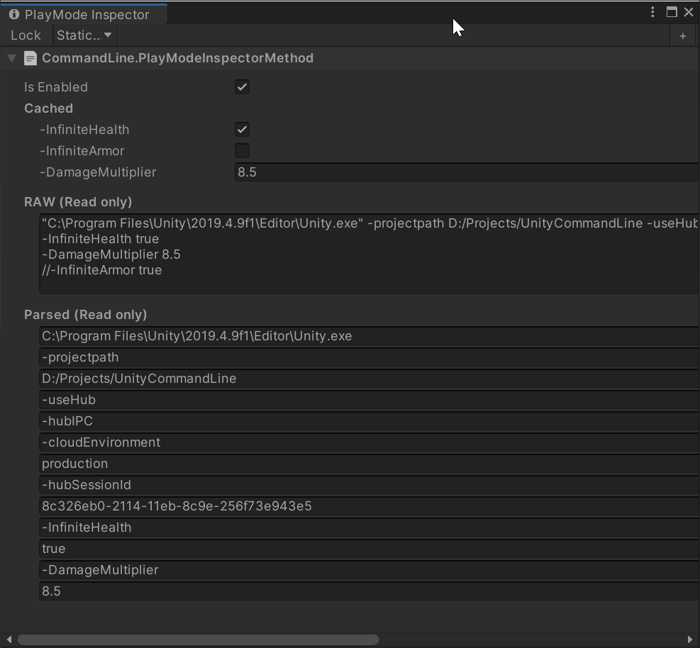

# CommandLine for Unity

The CommandLine for Unity package provides the ability to query key-value pairs, very similar to Unity's [PlayerPrefs](https://docs.unity3d.com/ScriptReference/PlayerPrefs.html) API.
The CommandLine options can be stored in a text file, for example:
```csharp
-InfiniteHealth true
//-InfiniteArmor true
-DamageMultiplier 8.5
```
In order to query if ```-InfiniteHealth``` is set, you use:
```csharp
CommandLine.GetBool("-InfiniteHealth", false);
```
The first argument ```-InfiniteHealth``` represents the key. The second argument ```false``` represents the default value, 
if the key could not be found in the commandline.

CommandLine supports the following types:
* ```float```
* ```int```
* ```bool```
* ```enum```
* ```string``` (use quotes to provide strings with spaces)

CommandLine supports the following comments in your text file:
* ```// line comments```
* ```/* block comments */```


# Installation

As of Unity 2019.3, Unity supports to add packages from git through the Package Manager window. 
In Unity's Package Manager, choose "Add package from git URL" and insert one of the Package URL's you can find below.

## Package URL's

| Version  |     Link      |
|----------|---------------|
| 1.0.0 | https://github.com/pschraut/UnityCommandLine.git#1.0.0 |


# Integration

* Create a text file in your project that is used to provide commandline options. I prefer ```Assets/StreamingAssets/CommandLine.txt```, but you can use any path you like.
* Load the commandline file using your favorite API during application/game startup.
* Call ```CommandLine.Init(text)``` with the text of the commandline file.
* Call ```CommandLine.GetBool(key, defaultValue)``` and friends to query commandline options.

I provide example code for each step below.


# Examples

## How to load from file
The simplest way to load a commandline file is to use ```System.IO```, which works on many or perhaps most platforms.

However, on Android you can't use ```System.IO``` and you must use ```UnityWebRequest``` instead, which isn't shown in the example below.

On some systems/consoles that require to mount a device before you can access it, you probably can't use the exact 
code below as well and need to modify the ```RuntimeInitializeLoadType``` option or call that method in your own application startup 
code.
```csharp
[RuntimeInitializeOnLoadMethod(RuntimeInitializeLoadType.AfterAssembliesLoaded)]
static void LoadCommandLine()
{
    // Use commandline options passed to the application
    var text = System.Environment.CommandLine + "\n";

    // Load the commandline file content.
    // You need to adjust the path to where the file is located in your project.
    var path = System.IO.Path.Combine(Application.streamingAssetsPath, "CommandLine.txt");
    if (System.IO.File.Exists(path))
    {
        text += System.IO.File.ReadAllText(path);
    }
    else
    {
#if UNITY_EDITOR || DEVELOPMENT_BUILD
        Debug.LogErrorFormat("Could not find commandline file '{0}'.", path);
#endif
    }

    // Initialize the CommandLine
    Oddworm.Framework.CommandLine.Init(text);
}
```
Using the [StreamingAssets](https://docs.unity3d.com/Manual/StreamingAssets.html) folder has the benefit that you can modify the commandline file in a build as well.
You don't need to create a new build, if you just want to start the game with different commandline options.

I don't provide a built-in method to load the CommandLine, because file loading code is very often project specific.


## How to use it
Once the CommandLine has been initialized, see example above, you can query it pretty much the same way
you use Unity's [PlayerPrefs](https://docs.unity3d.com/ScriptReference/PlayerPrefs.html).

Let's assume the CommandLine.txt file contains these options:
```csharp
-InfiniteHealth true
//-InfiniteArmor true
-DamageMultiplier 8.5
```
I prefer to write one option per line, but you can also have multiple options on the same line.
```csharp
-InfiniteHealth true /*-InfiniteArmor true*/ -DamageMultiplier 8.5
```

The C# code to query above options would be:
```csharp
using UnityEngine;
using Oddworm.Framework;

public class CommandLineExample : MonoBehaviour
{
    void Start()
    {
        var infiniteHealth = CommandLine.GetBool("-InfiniteHealth", false);
        Debug.LogFormat("InfiniteHealth: {0}", infiniteHealth);

        var infiniteArmor = CommandLine.GetBool("-InfiniteArmor", false);
        Debug.LogFormat("InfiniteArmor: {0}", infiniteArmor);

        var damageMultiplier = CommandLine.GetFloat("-DamageMultiplier", 1);
        Debug.LogFormat("DamageMultiplier: {0}", damageMultiplier);
    }
}
```
The output of above code is:
```
InfiniteHealth: True
InfiniteArmor: False
DamageMultiplier: 8.5
```
```InfiniteArmor``` is false, because the commandline option was commented out 
via ```//``` and thus the specified default value ```false``` was used instead.

The ```-``` symbol infront of each commandline option is just my personal preference, but it could be any other symbol too,
 or you could drop it entirely. The CommandLine code is not bound to any prefix.
If you don't like prefixes, just don't use them. If you prefer different symbol(s), you can use them too. 

## How to query enum options
Let's assume the CommandLine.txt file contains these options:
```csharp
-Fruit Pineapple
-Fruits "Apple, Coconut, Kiwi"
```

The C# code to query above options would be:
```csharp
enum Fruit
{
    None,
    Banana,
    Apple,
    Coconut,
    Pineapple,
    Kiwi
}

CommandLine.GetEnum<Fruit>("-Fruit", Fruit.None);


[System.Flags]
enum Fruits
{
    Banana = 1 << Fruit.Banana,
    Apple = 1 << Fruit.Apple,
    Coconut = 1 << Fruit.Coconut,
    Pineapple = 1 << Fruit.Pineapple,
    Kiwi = 1 << Fruit.Kiwi
}

CommandLine.GetEnum<Fruits>("-Fruits", 0);
```


## Disable CommandLine
You can turn off CommandLine with:
```csharp
CommandLine.isEnabled = false;
```
This will cause:
* CommandLine.HasKey returns false
* CommandLine.Get... calls return the default value


## Strip CommandLine code from release builds
If you don't want to support CommandLine in release builds or whatever specific builds you might have, 
you can add ```ODDWORM_COMMANDLINE_DISABLE``` to the ```Scripting Define Symbols``` found under 
```Edit > Project Settings > Player > Other```.

This will cause:
* CommandLine.isEnabled returns false
* CommandLine.HasKey returns false
* CommandLine.Get... calls return the default value
* CommandLine method bodies are stripped

## Full example
The full example in a single text block can be found below. Copy/paste, save it to a .cs file in your project and you're good to go.
```csharp
using UnityEngine;
using Oddworm.Framework;

public class CommandLineExample : MonoBehaviour
{
    void Start()
    {
        CommandLine.isEnabled = true;

        var infiniteHealth = CommandLine.GetBool("-InfiniteHealth", false);
        Debug.LogFormat("InfiniteHealth: {0}", infiniteHealth);

        var infiniteArmor = CommandLine.GetBool("-InfiniteArmor", false);
        Debug.LogFormat("InfiniteArmor: {0}", infiniteArmor);

        var damageMultiplier = CommandLine.GetFloat("-DamageMultiplier", 1);
        Debug.LogFormat("DamageMultiplier: {0}", damageMultiplier);
    }

    // On many platforms you can simply use System.IO to load a file as shown below.
    // On Android you can't use System.IO though, you need to use UnityWebRequest instead.
    [RuntimeInitializeOnLoadMethod(RuntimeInitializeLoadType.AfterAssembliesLoaded)]
    static void LoadCommandLine()
    {
        // Use commandline options passed to the application
        var text = System.Environment.CommandLine + "\n";

        // Load the commandline file content.
        // You need to adjust the path to where the file is located in your project.
        var path = System.IO.Path.Combine(Application.streamingAssetsPath, "CommandLine.txt");
        if (System.IO.File.Exists(path))
        {
            text += System.IO.File.ReadAllText(path);
        }
        else
        {
    #if UNITY_EDITOR || DEVELOPMENT_BUILD
            Debug.LogErrorFormat("Could not find commandline file '{0}'.", path);
    #endif
        }

        // Initialize the CommandLine
        Oddworm.Framework.CommandLine.Init(text);
    }

#if UNITY_EDITOR
    [UnityEditor.MenuItem("File/Open Commandline", priority = 1000)]
    static void OpenCommandLineMenuItem()
    {
        // The CommandLine.txt file location
        var path = System.IO.Path.Combine(Application.streamingAssetsPath, "CommandLine.txt");

        // If the directory does not exist, create it.
        var directory = System.IO.Path.GetDirectoryName(path);
        if (!System.IO.Directory.Exists(directory))
            System.IO.Directory.CreateDirectory(directory);

        // If the CommandLine.txt does not exist, create it.
        if (!System.IO.File.Exists(path))
        {
            System.IO.File.WriteAllText(path, "Need help? See https://github.com/pschraut/UnityCommandLine", System.Text.Encoding.UTF8);
            UnityEditor.AssetDatabase.Refresh();
        }

        // Open the CommandLine.txt file
        UnityEditor.EditorUtility.OpenWithDefaultApp(path);
    }
#endif
}

```


# Tips

## Menu Item
Create a menu item to easily open the commandline text file in your project.
```csharp
#if UNITY_EDITOR
[UnityEditor.MenuItem("File/Open Commandline", priority = 1000)]
static void OpenCommandLineMenuItem()
{
    // The CommandLine.txt file location
    var path = System.IO.Path.Combine(Application.streamingAssetsPath, "CommandLine.txt");

    // If the directory does not exist, create it.
    var directory = System.IO.Path.GetDirectoryName(path);
    if (!System.IO.Directory.Exists(directory))
        System.IO.Directory.CreateDirectory(directory);

    // If the CommandLine.txt does not exist, create it.
    if (!System.IO.File.Exists(path))
    {
        System.IO.File.WriteAllText(path, "Need help? Please see https://github.com/pschraut/UnityCommandLine", System.Text.Encoding.UTF8);
        UnityEditor.AssetDatabase.Refresh();
    }

    // Open the CommandLine.txt file
    UnityEditor.EditorUtility.OpenWithDefaultApp(path);
}
#endif
```

## PlayMode Inspector
If you have my [PlayMode Inspector](https://github.com/pschraut/UnityPlayModeInspector) packages installed, 
you can also see the internals of CommandLine as shown in the image below. 
For this open PlayMode Inspector from ```Window > Analysis > PlayMode Inspector``` and use the ```Static...``` drop-down to select
```CommandLine.PlayModeInspectorMethod```.

